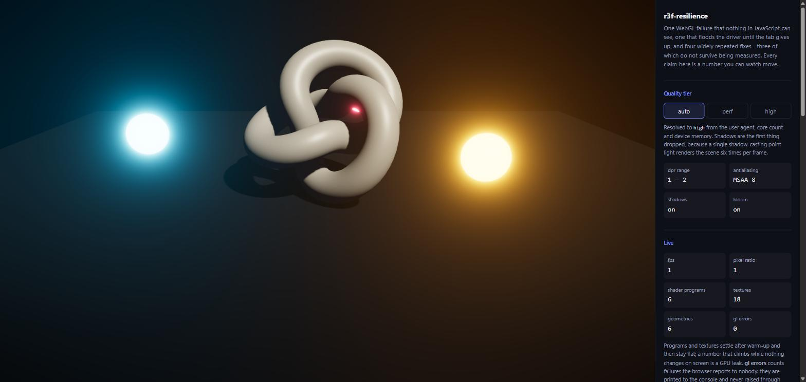
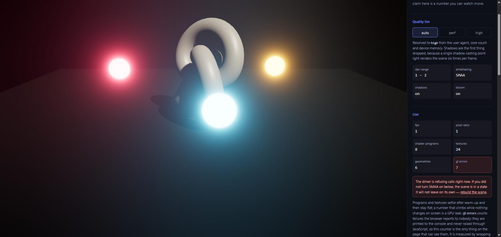

# r3f-resilience

**[Open the live demo →](https://r3f-resilience.vercel.app/)**

[](https://github.com/QuentinBretl/r3f-resilience/actions/workflows/test.yml)

A React Three Fiber scene that breaks on purpose. One WebGL failure that nothing
in JavaScript can see, one that floods the driver until the tab gives up, and a
counter on the page that lets you watch both happen.



It comes out of Lycanthropia, a 40k-line multiplayer browser game — private, and
staying that way — where this happened for real, on other people's hardware,
during sessions that lasted an hour. What made
these failures expensive was not that they are hard to fix. It is that **nothing
in JavaScript ever sees them**: no exception, no error boundary, no rejected
promise, no failed request. The scene stops being right, the logs stay clean, and
users describe it as "slow".

Which is also why so much of the advice about them is wrong in a way nobody
notices. If you cannot see the failure, you cannot see that your fix did nothing.
Four of the fixes everyone repeats are checked here. Three do not survive.

## The instrument

A WebGL error is not thrown. The browser prints it and returns normally, so
nothing that wraps the console API can see one, no logger catches it, and reading
the code will not tell you which call is failing.

The way out is to stop reading and start counting. `demo/glProbe.js` wraps the
call under suspicion and reads the GL error queue right after it:

```js
proto.blitFramebuffer = function (...args) {
  state.blits += 1;
  const result = original.apply(this, args);
  if (this.getError() !== 0) state.errors += 1;   // ← the whole idea
  return result;
};
```

That turns "something somewhere is wrong" into a call site, a stack, and the
**gl errors** counter in the panel. `getError()` is a synchronous round trip to
the driver, which is why this is instrumentation and not production code — but a
handful of blits per frame makes it cheap enough to leave armed while you work.

## 1 — A lost context is silent, and silence is the whole problem

Contexts are lost for reasons outside your code: a driver reset, a laptop
switching GPUs, a background tab reclaimed by the browser, or one WebGL context
too many on the page.

Uncheck **Let the application notice**, kill the context, and look at the whole
page rather than the canvas. The scene is black. Every counter still reads
healthy. The render loop is still running at full speed into a context that
ignores every draw call. Nothing throws, and the only trace anywhere is one line
in a console nobody has open: `THREE.WebGLRenderer: Context Lost.`

That is the failure. Not that the scene cannot come back — it can, and there is
remarkably little you have to do about that — but that **your application is
never told**, so your users are the monitoring. They see a black rectangle, read
it as a slow page, and never file a report. My logs were clean for weeks.

So the job is detection, and then three small things:

- **Say something.** A notice over the canvas turns a silent failure into a
  support ticket you can act on.
- **Stop rendering.** A lost context still accepts draw calls, it just ignores
  them. `frameloop: 'never'` while lost saves a few hundred pointless frames a
  second.
- **Cover the canvas, do not replace it.** Restoring works on the canvas still
  mounted underneath the notice.

```jsx
const { onCreated, lost } = useWebGLContextLoss();

<div style={{ position: 'relative' }}>
  <Canvas frameloop={lost ? 'never' : 'always'} onCreated={onCreated}>{/* ... */}</Canvas>
  {lost && <SceneUnavailable />}
</div>
```

Two details that carry real weight: **detach the listeners** on unmount *and*
before attaching to a new canvas, because r3f calls `gl.forceContextLoss()`
itself when a Canvas unmounts and that fires an ordinary `webglcontextlost` —
leave a listener attached and every route change is reported to users as a crash.
And **`getExtension()` returns `null` while a context is lost**, by
specification, so `WEBGL_lose_context` has to be captured while the context is
still alive.

## 2 — Any depth-reading effect blits a depth texture onto itself, every frame

Turn on **Antialias with SMAA** and the counter goes from zero to roughly 230 per
second. Measured here: 4245 blits and 0 errors on MSAA, then 700 blits and
**700 errors** in the first three seconds of SMAA. Every single blit refused.

It is not a driver quirk. The same `GL_INVALID_OPERATION` appears on a discrete
AMD card and on SwiftShader, the software rasteriser CI renders with — 686
refused calls against 15 in the same wall time, the difference being frames
drawn, not behaviour. A software renderer refusing it is what makes this a
specification violation rather than a vendor bug.



The short version: an effect declaring `EffectAttribute.DEPTH` makes the composer
clone the input buffer's depth texture into a "stable" one, a cloned three.js
texture shares its `Source`, and three.js allocates one GPU texture per Source —
so the composer spends every frame asking the driver to copy one image onto
itself. WebGL refuses, politely, sixty times a second.

Nothing is drawn wrong, which is what makes it easy to dismiss. But the flood is
expensive enough to leave the tab unable to respond, at which point every control
on the page looks broken and the cause is nowhere near the controls.

**Eight effects reach it** on `postprocessing` 6.39.4: `BokehEffect`,
`DepthEffect`, `DepthOfFieldEffect`, `GodRaysEffect`, `RealisticBokehEffect`,
`SelectiveBloomEffect`, `SSAOEffect` — and `SMAAEffect`, the ordinary,
recommended way to antialias a chain. Antialias with `multisampling` on the
composer instead; MSAA is innocent here.

[The full trace, line by line through `node_modules` →](FINDINGS.md#the-depth-blit-in-full)

## Four claims that did not survive measurement

Every one is repeated widely, and I believed all four. Three were the
load-bearing advice in the first version of this README.

| Claim | What measurement says |
| --- | --- |
| Call `preventDefault()` on `webglcontextlost` or the loss is permanent | True on a bare canvas, and **already done for you**: three.js calls it in its own listener (`three.module.js:29380`). No r3f app ever needed that line. |
| Unmount the Canvas and the loss becomes permanent | No. The orphaned canvas still receives the event and React mounts a new one. It costs a full GPU rebuild, not the scene. |
| Rebuild the effect chain after a restore | **Worse than unnecessary — destructive.** Disposing the old composer *after* the context returns deletes objects from a dead generation and breaks the resolve on every frame after. |
| An inline `EffectComposer` leaks GPU memory | The pass list is diffed now, so an ordinary re-render rebuilds nothing at all: zero `addPass`/`removePass` over 150 renders. |

The third is checkable from the panel in one click, and it is the interesting
one: the advice is not wrong about the mechanism, it is wrong about the *timing*.
Rebuild while the context is still lost and it is harmless. Rebuild after the
restore and every delete is a real call against a context that never owned those
objects.

[Each claim, with the method used to check it →](FINDINGS.md#the-four-claims)

## Running it

```bash
npm install
npm run dev
```

`src/` is three small files, kept separate from the demo so the demo imports them
the way a consumer would. Not published to npm and not meant to be — copy what
you need.

| Export | What it does |
| --- | --- |
| `useWebGLContextLoss(opts?)` | `{ onCreated, lost, reset }`. Hand `onCreated` to the Canvas. |
| `resolveQualityTier(quality?)` | `'perf'` or `'high'` from the device. SSR safe. Pass a tier to force it. |
| `getQualityProfile(quality?)` | Resolves the tier and returns its profile. |
| `QUALITY_PROFILES` | The two budgets. Spread them to add project flags. |
| `loseContext` / `restoreContext` | Drop and restore a context on purpose, to exercise recovery. |
| `countPrograms(renderer)` | Compiled shader programs. Your leak detector. |

There is no renderer here, no engine, no component library and no state
management. It is the handful of things that turned out to be load-bearing once a
scene had to survive strangers on unknown hardware.

The device-quality tiers and two colour traps that get blamed on the effects
library are in [FINDINGS.md](FINDINGS.md) as well.

## The claims are tested

A repository whose argument is "stop believing this and count it" has no business
asserting any of it by hand. `npm test` drives the built demo in a real browser
and reads the same counter a visitor reads:

```bash
npm test
```

Five specs, run on every push: the scene renders with zero refused calls and
flat program counts; SMAA makes that counter climb and MSAA does not; a lost
context raises a notice when the application looks for it and nothing at all
when it does not; the effect chain survives a loss without being rebuilt; and
the quality tiers change the budget they advertise.

They are checked against mutation rather than trusted: neutralising the SMAA
effect fails the second spec, and making the notice ignore the detection switch
fails the third.

## Where these numbers come from

Measured in September 2026 on Chrome / Windows 11, with `three` 0.169.0,
`postprocessing` 6.39.4, `@react-three/postprocessing` 3.1.1 and
`@react-three/fiber` 9.7.0 — pinned exactly in `package.json`, because three of
the findings above are statements about specific versions and would be worthless
without them. One machine, one browser. If yours differ, that is what the demo is
for: rerun it and see what your numbers say.

## Licence

MIT
